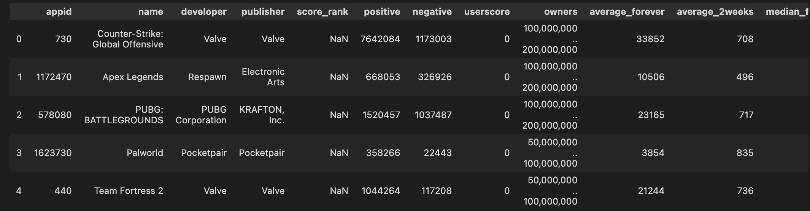
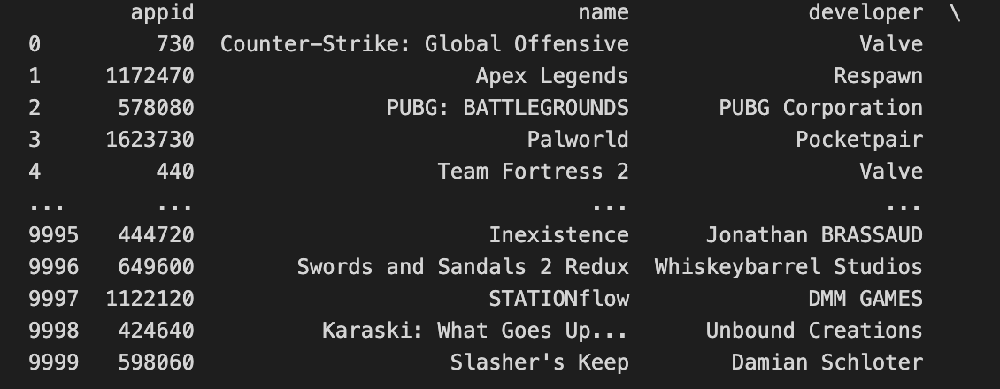
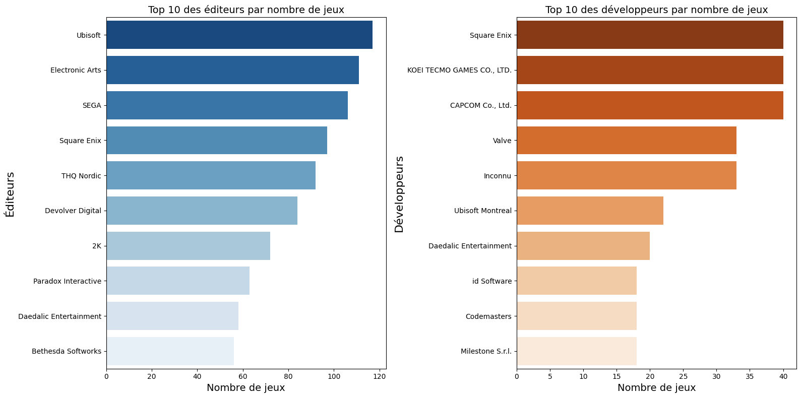
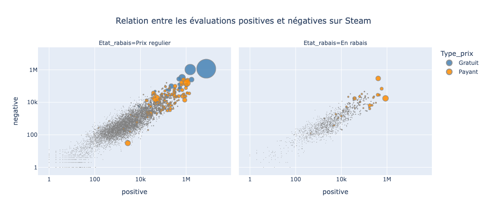
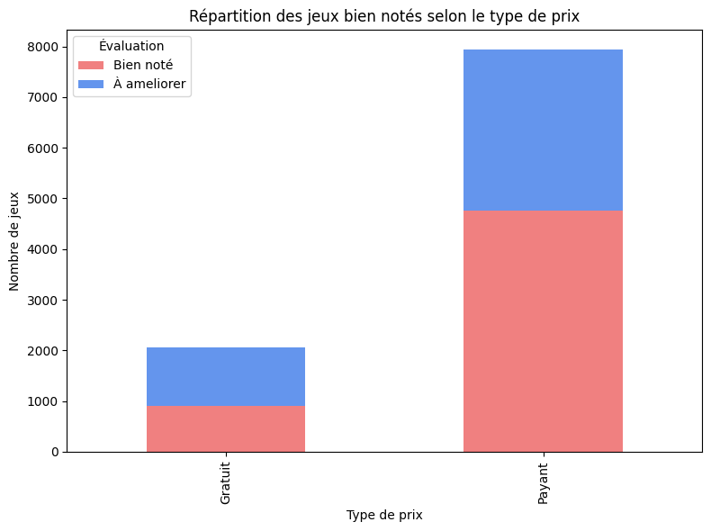

# TP4 - Analyse de donnees sur les jeux Steam avec des librairies scientifiques

## Directives
:alarm_clock: Date de remise : Le 12 avril 2026 avant minuit

À remettre sur Github (la correction peut se baser sur votre dernier `git push` effectué avant la date limite).

## Introduction
Vous êtes analyste de données pour une équipe qui étudie le marché des jeux vidéo sur Steam. Vous disposez d'une base de données `steam_games_dataset.csv` contenant des informations sur 10 000 jeux, notamment :

- `appid` : identifiant unique du jeu
- `name` : nom du jeu
- `developer` : studio de développement
- `publisher` : éditeur
- `score_rank` : rang de score (souvent vide)
- `positive` et `negative` : nombre d'évaluations positives et négatives
- `owners` : estimation du nombre de propriétaires
- `average_forever` et `average_2weeks` : temps de jeu moyen en minutes
- `median_forever` et `median_2weeks` : temps de jeu médian en minutes
- `price` et `initialprice` : prix en cents
- `discount` : pourcentage de rabais
- `ccu` : nombre de joueurs simultanés

Votre objectif est de nettoyer cette base de données, d'en extraire des statistiques descriptives et de la visualiser à l'aide de représentations graphiques. Pour ce faire, vous serez amenés à utiliser les librairies Python suivantes :

- Pandas : pour manipuler des données tabulaires avec des DataFrames
- NumPy : pour effectuer des traitements numériques et créer des colonnes conditionnelles
- Matplotlib : pour produire des graphiques 2D personnalisés
- Seaborn : pour réaliser facilement des visualisations statistiques
- Plotly : pour créer des graphiques interactifs

Pour ce TP, nous allons travailler avec un Jupyter Notebook (`.ipynb`).

## Qu'est-ce qu'un Jupyter Notebook ?
Un Jupyter Notebook est un environnement interactif utilise pour ecrire et exécuter du code, ainsi que pour visualiser des resultats en temps reel. Il permet d'integrer a la fois du code, des commentaires textuels (Markdown), des visualisations et des equations mathematiques.

### Structure d'un Jupyter Notebook
Un notebook se compose de cellules qui peuvent être :

- Cellules de code : où vous écrivez et executez du code Python
- Cellules Markdown : où vous ajoutez des explications, des descriptions ou des notes en utilisant le langage Markdown

### Comment ça fonctionne
Lorsqu'un Jupyter Notebook est ouvert, vous pouvez exécuter chaque cellule individuellement, ce qui permet une exécution étape par étape. Les résultats (comme les graphiques ou les variables calculées) sont affichés directement sous la cellule de code.

Il est également possible d'exécuter toutes les cellules l'une à la suite de l'autre avec le bouton "Run All" dans VS Code.

## Installations requises
Avant de débuter ce TP, vous devez installer Jupyter ainsi que l'extension de Jupyter Notebook dans VS Code.

1. Pour installer Jupyter, ouvrez un nouveau terminal dans VS Code et entrez la commande suivante :

```bash
pip install jupyter
```

2. Ensuite, installez l'extension Jupyter, si ce n'est pas deja fait, dans VS Code :

- Allez à l'icone des extensions dans la barre laterale de gauche
- Recherchez Jupyter
- Installez l'extension Jupyter developpée par Microsoft

Elle devrait ressembler à ceci :


Si vous devez revenir à une version précedente de l'extension, vous pouvez suivre le même principe que dans l'exemple ci-dessous :


Une fois Jupyter et l'extension installés, vous pouvez ouvrir le notebook `TP4.ipynb` dans ce dossier et suivre les instructions.

Vous devrez également installer les librairies Pandas, NumPy, Matplotlib, Seaborn et Plotly. Les instructions d'installation se retrouvent dans le notebook `TP4.ipynb`.

## Instructions pour le TP
Les étapes detaillées et les instructions pour réaliser ce TP sont disponibles dans le Jupyter Notebook `TP4.ipynb`.

### Résultats attendus pour les exercices du TP

#### Partie 1 : 

- Votre DataFrame final ne devrait plus contenir les colonnes `score_rank` et `userscore`
- La colonne `owners` devrait avoir été transformée en borne minimale numérique, et les colonnes `Type_prix`, `Etat_rabais` et `prix_dollars` devraient etre présentes.
- L'affichage des dataframes devrait ressembler à ceci :

    

    Et non à ceci : 

    

#### Partie 2 : 

- Vos tableaux statistiques devraient être retournés sous forme de DataFrames bien structurés (**ne pas utiliser de `print` pour l'affichage**), avec des colonnes explicites et des proportions affichées en pourcentage.

#### Partie 3 :
- Voici un exemple de bonne solution pour le graphique de la partie 3.1 : 

   

- Voici un exemple de bonne solution pour le graphique de la partie 3.2 : 

   

#### Bonus :
- Voici un exemple de bonne solution pour le bonus : 

   

## Bareme de correction

Le barème de correction pour ce TP est le suivant :

| **Partie** | **Tache** | **Points** |
|---|---|---:|
| **Partie 1 : Chargement et nettoyage des donnees avec pandas** |  | **/6** |
|  | 1.1 Compléter la fonction `charger_donnees` | 1 |
|  | 1.2 Utiliser `charger_donnees` pour obtenir le DataFrame | 0.5 |
|  | 1.3 Affichage du DataFrame | 0.5 |
|  | 1.4 Compléter la fonction `supprimer_colonnes` | 1 |
|  | 1.5 Utiliser `supprimer_colonnes` pour supprimer les colonnes `score_rank` et `userscore` | 0.5 |
|  | 1.6 Affichage du DataFrame modifié | 0.5 |
|  | 1.7 Compléter la fonction `convertir_owners_min` | 1 |
|  | 1.8 Utiliser `convertir_owners_min` pour transformer `owners` | 0.5 |
|  | 1.9 Création des colonnes derivées avec NumPy et affichage | 0.5 |
| **Partie 2 : Calcul des statistiques** |  | **/5** |
|  | 2.1 Affichage du nombre de jeux par catégorie | 1 |
|  | 2.2 Compléter la fonction `stats_par_groupe` | 1 |
|  | 2.3 Affichage des statistiques avec `stats_par_groupe` (3 affichages à 0.5 chacun) | 1.5 |
|  | 2.4 Compléter la fonction `proportion_jeux_bien_notes_par_type_prix` | 1 |
|  | 2.5 Affichage du DataFrame avec proportions (%) | 0.5 |
| **Partie 3 : Visualisation des données** |  | **/9** |
|  | 3.1 Diagrammes en barres horizontales avec Seaborn | 5 |
|  | 3.2 Nuage de points interactif avec Plotly | 4 |
| **Bonus** | Question bonus | +1 |
| **Total** |  | **/20** |

*A noter que la note maximale est de 100 % (donc si vous avez 20/20 + 1 point bonus, vous aurez quand meme 20/20 sur le TP).*
